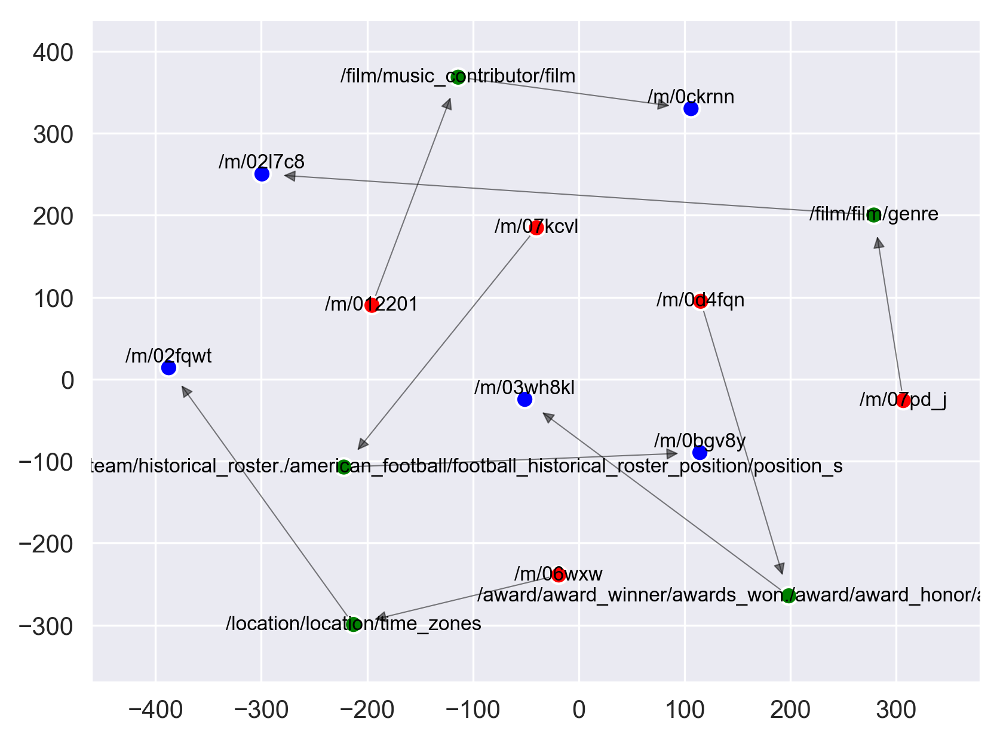

# Python Knowledge Graph Embedding Library

This library is an outcome of a bold and optimistic attempt to bring all the state-of-the-art knowledge graph embedding algorithms into 
one single python library. 

## Implemented Methods
We aim to implement all the latest state-of-the-art knowledge graph embedding library. So far these are the implemented algorithms:

### Latent Feature Models
These modles utilize a latent feature of either entities or relations to explain the triples of the Knowledge graph. The features are called latent as they are not directly observed. The interaction of the entities and the relations are captured through their latent space representation. 

#### Latent Distance Models
These models utilized the distance-based scoring functions to embed the knowledge graph triples. 

* [TransE](http://papers.nips.cc/paper/5071-translating-embeddings-for-modeling-multi-rela): TransE is an energy based model which represents the
relationships as translations in the embedding space. Which
means that if (h,l,t) holds then the embedding of the tail
't' should be close to the embedding of head entity 'h'
plus some vector that depends on the relationship 'l'.
Both entities and relations are vectors in the same space[1]. 

* [TransH](https://pdfs.semanticscholar.org/2a3f/862199883ceff5e3c74126f0c80770653e05.pdf): TransH follows the general principle of the TransE. However, compared to it, it introduces relation-specific hyperplanes. The entities are represented as vecotrs just like in TransE, however, the relation is modeled as a vector on its own hyperplane with a normal vector. The entities are then projected to the relation hyperplane to calculate the loss. 

* [TransR](http://nlp.csai.tsinghua.edu.cn/~lyk/publications/aaai2015_transr.pdf): TransR is pretty similar to TransH, the only difference being that rather than having one relation hyperplane, it introduces relation-specific hyperplanes. The entities are vecotr in entity space and each relation is a vector in relation specific space. For calculating the loss, the entities are projected to relation specific space using the projection matrix. 

####  Semantic Matching Models
Semantic matching models are latent feature models which represents triples by using a pairwise interactions of latent features. 

* [RESCAL](http://www.icml-2011.org/papers/438_icmlpaper.pdf): Rescal is a latent feature model where each relation is represented as a matrix modeling the iteraction between latent factors. It utilizes a weight matrix which specify how much the latent features of head and tail entities interact in the relation.  

* [Semantic Matching Energy (SME)](http://www.thespermwhale.com/jaseweston/papers/ebrm_mlj.pdf): SME utilizes a neural network architecture to perform the semantic matching. The energy of the triples are computed by a parameterized function which relies on matching criterion computed between both sides of the triples. The semantic energy function learns to distinguish plausible combinations of entities from implausible ones. It consists of two variation SMElinear and SMEbilinear.

## Datasets
We intend to provide the libraries to test the knowledge graph algorithms against all the well-known datasets available online. So far the library is able to work with the following datasets:
* [Freebase](https://everest.hds.utc.fr/lib/exe/fetch.php?media=en:fb15k.tgz): Freebase is a large collaborative knowledge base consisting of data composed mainly by its community members. It is an online collection of structured data harvested from many sources, including individual, user-submitted wiki contributions [2].

## Repository Structure
* **pyKG2Vec/config**: This folder consists of the configuration module. It provides the necessary configuration to parse the datasets, and also consists of the baseline hyperparameters for the knowledge graph embedding algorithms. 
* **pyKG2Vec/core**: This folder consists of the core codes of the knowledge graph embedding algorithms. Inside this folder, each algorithm is implemented as a separate python module. 
* **pyKG2Vec/utils**: This folders consists of modules providing various utilities, such as data preparation, data visualization, and evaluation of the algorithms.

## Dependencies
The goal of this library is to minimize the dependency on other libraries as far as possible to rapidly test the algorithms against different dataset. We emphasize that in the beginning, we will not be focus in run-time performance. However, in the future, may provide faster implementation of each of the algorithms. We encourage installing the tensorflow-gpu version for optimal usage. 

* networkx==2.2
* matplotlib==3.0.3
* numpy==1.16.2
* seaborn==0.9.0
* scikit_learn==0.20.3
* tensorflow==`<version suitable for your workspace>`

## Install
For best performance, we encourage the users to create a virtual environment and setup the necessary dependencies for running the algorithms.

**Please install [tensorflow](https://www.tensorflow.org/install) cpu or gpu version before performing pip install of pykg2vec!**

Prepare your environment:
```bash
sudo apt update
sudo apt install python3-dev python3-pip
sudo pip3 install -U virtualenv     
```
 Create a virtual environment:
```bash
virtualenv --system-site-packages -p python3 ./venv
```
 Activate the virtual environment using a shell-specific command:  
```bash
source ./venv/bin/activate
``` 
 Upgrade pip:  
```bash
pip install --upgrade pip
```
 Install pyKG2Vec:  
```bash
(venv) $ pip install pykg2vec
``` 
 ## Usage Example
```python
import tensorflow as tf

#import the models from the packages
from pykg2vec.core.TransE import TransE
from pykg2vec.core.TransH import TransH
from pykg2vec.core.TransR import TransR
from pykg2vec.core.Rescal import Rescal
from pykg2vec.core.SMEBilinear import SMEBilinear
from pykg2vec.core.SMELinear import SMELinear

#import the model configurations from the package
from pykg2vec.config.config import TransEConfig, TransHConfig, TransRConfig, RescalConfig, SMEConfig

#import package to import and process knowledge graph data
from pykg2vec.utils.dataprep import DataPrep

#import the module to train all the models
from pykg2vec.utils.trainer import Trainer

#we are creating an experiment function to train all the models
def experiment():

    # preparing dataset. 
    knowledge_graph = DataPrep('Freebase15k')

    # preparing settings. 
    epochs = 200
    batch_size = 128
    learning_rate = 0.01
    #If entity and relation embedding vector is same, we use hidden_size
    hidden_size = 50

    #variable for specific entity and relation embedding sizes
    ent_hidden_size = 64
    rel_hidden_size = 32

    #for each model we define configuration parameters
    transEconfig = TransEConfig(learning_rate=learning_rate,
                                batch_size=batch_size,
                                epochs=epochs, hidden_size=hidden_size)

    transHconfig = TransHConfig(learning_rate=learning_rate,
                                batch_size=batch_size,
                                epochs=epochs, hidden_size=hidden_size)

    transRconfig = TransRConfig(learning_rate=learning_rate,
                                batch_size=batch_size, 
                                ent_hidden_size=ent_hidden_size,
                                rel_hidden_size=rel_hidden_size,
                                epochs=epochs)

    rescalconfig = RescalConfig(learning_rate=0.1,
                                batch_size=batch_size,
                                epochs=epochs, hidden_size=hidden_size)

    smeconfig    = SMEConfig(learning_rate=learning_rate,
                             batch_size=batch_size,
                             epochs=epochs, hidden_size=hidden_size)

    configs = [transEconfig, transHconfig, transRconfig, rescalconfig, smeconfig]

    #we modify some common procedurial configuration
    for config in configs:
        #Perform test every 10 epochs
        config.test_step  = 10
        #perform test on 1000 triples
        config.test_num   = 1000
        #save the learned model parameters
        config.save_model = True
        #display the result of training and testing the model
        config.disp_result= True

    # preparing models. 
    models = [] 
    models.append(TransE(transEconfig, knowledge_graph))
    models.append(TransH(transHconfig, knowledge_graph))
    models.append(TransR(transRconfig, knowledge_graph))
    models.append(Rescal(rescalconfig, knowledge_graph))
    models.append(SMEBilinear(smeconfig, knowledge_graph))
    models.append(SMELinear(smeconfig, knowledge_graph))

    # train models.
    for model in models:
        print("training model %s"%model.model_name)
        trainer = Trainer(model=model)

        #first build and initialize the model
        trainer.build_model()
        #train the model
        trainer.train_model()
        #perform test with all the test triples
        trainer.full_test()

        tf.reset_default_graph()

if __name__ == "__main__":
   experiment()
```  
  
The output of code will be as follows:

    
<p align="center">
  
</p> 
      
The red nodes represent head entity, green nodes represent the relations and the blue node represents the tail entities.
## Learn More
Here are some links to get you started with knowledge graph embedding methodologies.

 * [A Review of Relational Machine Learning for Knowledge Graphs](https://ieeexplore.ieee.org/stamp/stamp.jsp?tp=&arnumber=7358050)
 * [Knowledge Graph Embedding: A Survey of Approaches and Applications](https://ieeexplore.ieee.org/stamp/stamp.jsp?tp=&arnumber=8047276)
 
## Cite
  Please kindly cite us if you found the library helpful. 
   ```
   @online{pykg2vec,
  author = {Rokka Chhetri, Sujit and  Yu, Shih-Yuan and  Salih Aksakal, Ahmet and  Goyal, Palash and  Canedo Arquimedes, Martinez},
  title = {{pykg2vec: Python Knowledge Graph Embedding Library},
  year = 2019,
  url = {https://pypi.org/project/pykg2vec/}
  }
    
   ```
   
