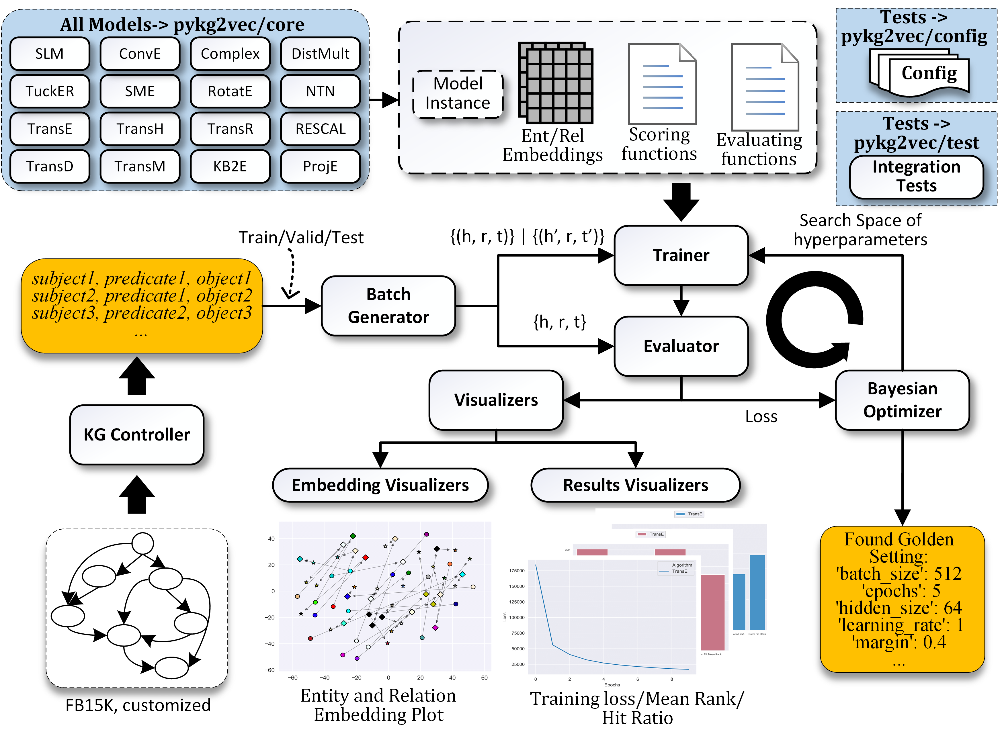

Software Architecture and API Documentation
###########################################

The pykg2vec is built using Python and PyTorch. It allows the computations to be assigned on both GPU and CPU. In addition to the main model training process, pykg2vec utilizes multi-processing for generating mini-batches and performing an evaluation to reduce
the total execution time. The various components of the library are as follows:

1) ``KG Controller`` - handles all the low-level parsing tasks such as finding the total unique set of entities and relations; creating ordinal encoding maps; generating training, testing and validation triples; and caching the dataset data on disk to optimize tasks that involve repetitive model testing.
2) ``Batch Generator`` - consists of multiple concurrent processes that manipulate and create mini-batches of data.  These mini-batches are pushed to a queue to be processed by the models implemented in PyTorch or TensorFlow. The batch generator runs independently so that there is a low latency for feeding the data to the training module running on the GPU.
3) ``Core Models`` - consists of large number of state-of-the-art KGE algorithms implemented as Python modules in PyTorch and TensorFlow.  Each module consists of a modular description of the inputs, outputs, loss function,and embedding operations. Each model is provided with configuration files that define its hyperparameters.
4) ``Configuration`` - provides the necessary configuration to parse the datasets and also consists of the baseline hyperparameters for the KGE algorithms as presented in the original research papers.
5) ``Trainer and Evaluator`` - the Trainer module is responsible for taking an instance of the KGE  model, the respective hyperparameter configuration, and input from the batch generator to train the algorithms. The Evaluator module performs link prediction and provides the respective accuracy in terms of mean ranks and filtered mean ranks.
6) ``Visualization`` - plots training loss and common metrics used in KGE tasks. To facilitate model analysis, it also visualizes the latent representations of entities and relations on the 2D plane using t-SNE based dimensionality reduction.
7) ``Bayesian Optimizer`` - pykg2vec uses a Bayesian hyperparameter optimizer to find a golden hyperparameter set. This feature is more efficient than brute-force based approaches.

====

.. contents:: Contents
    :local:

pykg2vec
======================

.. automodule:: pykg2vec.config
   :members:

.. automodule:: pykg2vec.hyperparams
   :members:

====

pykg2vec.models
======================

pykg2vec.models.pairwise
------------------------

.. automodule:: pykg2vec.models.pairwise
   :members:

pykg2vec.models.pointwise
-------------------------

.. automodule:: pykg2vec.models.pointwise
   :members:

pykg2vec.models.projection
--------------------------

.. automodule:: pykg2vec.models.projection
   :members:

====

pykg2vec.utils
==============

pykg2vec.utils.bayesian_optimizer
---------------------------------

.. automodule:: pykg2vec.utils.bayesian_optimizer
   :members:

pykg2vec.utils.evaluator
------------------------

.. automodule:: pykg2vec.utils.evaluator
   :members:

pykg2vec.utils.generator
------------------------

.. automodule:: pykg2vec.utils.generator
   :members:

pykg2vec.utils.trainer
----------------------

.. automodule:: pykg2vec.utils.trainer
   :members:

pykg2vec.utils.visualization
----------------------------

.. automodule:: pykg2vec.utils.visualization
   :members:

pykg2vec.utils.kgcontroller
---------------------------

.. automodule:: pykg2vec.utils.kgcontroller
   :members:

====

pykg2vec.test
======================

After installation, you can use `pytest` to run the test suite from pykg2vec's root directory::

  pytest

pykg2vec.test.test_generator
----------------------------

.. automodule:: pykg2vec.test.test_generator
   :members:

pykg2vec.test.test_kg
---------------------

.. automodule:: pykg2vec.test.test_kg
   :members:

pykg2vec.test.test_model
------------------------

.. automodule:: pykg2vec.test.test_model
   :members: